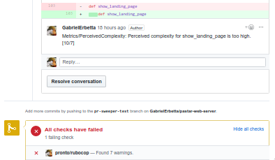

# Limpurb
> Simple API for automatically running linters to GitHub repositories pull requests


This is an API built in Ruby with Hanami that handles pull request webhooks from GitHub, runs Pronto to lint the changes made in that PR and send the review to the pull request page as comments and more.
Out of the box, this is configured to only run Rubocop linter for Ruby code. For other languages and linters you can check [Pronto](https://github.com/prontolabs/pronto) repository and look for the other runners (they have them for JS, PHP and more). It should be as simple as adding them as gems in the Gemfile.



## Setting up integration with GitHub

Most of the work will be done by Docker but there are some things that need to be set up for the GitHub integration. You will need three things: a Personal Access Token, a ssh key and a repository with pull request webhook enabled.
- *Personal Access Token*: You will need an account with access to the repositories and then set up a personal access token in GitHub settings. It needs repo scope access to allow for the review;
- *SSH key*: The account will need an ssh key for downloading the repos too. Put it in `keys/github_key`;
- *Webhook*: In your repositories settings, set up a webhook for Pull request events to `/sweep` route;

## Installing and running

Once you have set up the token and key, just let docker do it's magic.
```
docker build -t pr-sweeper .
docker run  -e "PRONTO_GITHUB_ACCESS_TOKEN=xxxx" -d -p 80:4567 pr-sweeper
```

You can put the linter configuration files in the root folder and it will work.

